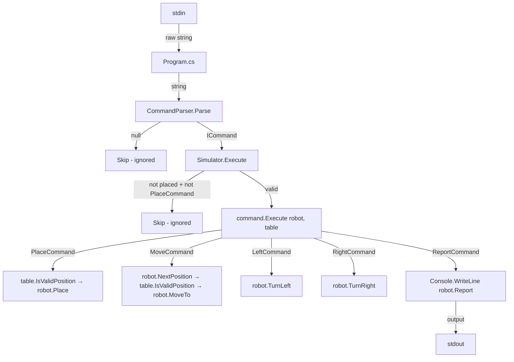
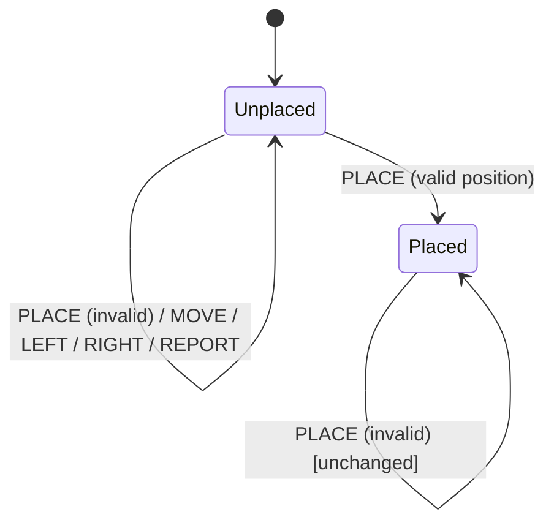

# Toy Robot Simulator — Architecture Document

> **Target Runtime:** .NET 8.0 LTS | **Language:** C# 12 | **App Type:** Console (stdin/stdout)

---

## 1. System Overview

A console application simulating a toy robot on a 5×5 grid. Robot accepts commands via stdin: `PLACE X,Y,F`, `MOVE`, `LEFT`, `RIGHT`, `REPORT`. Only `REPORT` produces output. All invalid/premature commands are silently ignored.

### Constraints (MUST enforce)

| # | Constraint |
|---|---|
| C1 | Table is 5×5. Valid positions: X ∈ [0,4], Y ∈ [0,4] |
| C2 | Origin (0,0) is SOUTH-WEST corner |
| C3 | First valid command MUST be `PLACE`. All commands before a valid `PLACE` are ignored |
| C4 | `PLACE` off-table is ignored. Robot remains unplaced |
| C5 | `MOVE` that would leave the table is ignored. Robot stays in place |
| C6 | Unknown/malformed commands are silently ignored |
| C7 | Input is case-insensitive. `place 0,0,north` = `PLACE 0,0,NORTH` |

### I/O Contract

| Input | Output | Condition |
|---|---|---|
| `PLACE X,Y,F` | _(none)_ | Places robot if position valid, else ignored |
| `MOVE` | _(none)_ | Moves 1 unit in facing direction if within bounds |
| `LEFT` | _(none)_ | Rotates 90° counter-clockwise |
| `RIGHT` | _(none)_ | Rotates 90° clockwise |
| `REPORT` | `X,Y,F\n` to stdout | Outputs current position and direction |
| `EXIT` | _(app terminates)_ | Interactive mode only |
| _(empty/whitespace)_ | _(none)_ | Silently ignored |
| _(unrecognized)_ | _(none)_ | Silently ignored |
| _(EOF / null)_ | _(app terminates)_ | Graceful exit |

### Spec Examples (MUST pass as tests)

```
Example 1: PLACE 0,0,NORTH → MOVE → REPORT → Output: "0,1,NORTH"
Example 2: PLACE 0,0,NORTH → LEFT → REPORT → Output: "0,0,WEST"
Example 3: PLACE 1,2,EAST → MOVE → MOVE → LEFT → MOVE → REPORT → Output: "3,3,NORTH"
```

---

## 2. Architecture Pattern

**Layered Architecture + Command Pattern**

```
stdin → [Program.cs REPL] → [CommandParser] → [Simulator] → [Commands] → [Robot + Table]
                                                                              ↓
                                                                          stdout (REPORT only)
```

| Layer | Responsibility | Depends On |
|---|---|---|
| `Program.cs` | Read stdin, REPL loop, detect interactive/piped mode | CommandParser, Simulator |
| `Parsing/CommandParser` | String → ICommand (or null) | Command classes, Direction enum |
| `Simulation/Simulator` | Guard "is placed", delegate to command | Robot, Table, ICommand |
| `Commands/*` | Execute single action on Robot | Robot, Table, Position, Direction |
| `Models/*` | Domain state: Robot, Position, Direction, Table | _(none — leaf layer)_ |

---

## 3. Tech Stack

| Category | Technology | Version | Install |
|---|---|---|---|
| Language | C# | 12 | Included in .NET SDK |
| Runtime | .NET | 8.0 LTS | `winget install Microsoft.DotNet.SDK.8` |
| Test Framework | xUnit | 2.9+ | `dotnet add package xunit` |
| Assertions | FluentAssertions | 7.0+ | `dotnet add package FluentAssertions` |
| Build/Run | dotnet CLI | 8.0 | Included in .NET SDK |

---

## 4. Project Structure

```
ToyRobot/
├── src/
│   └── ToyRobot/
│       ├── ToyRobot.csproj
│       ├── Program.cs
│       ├── GlobalUsings.cs
│       ├── Models/
│       │   ├── Position.cs
│       │   ├── Direction.cs
│       │   ├── DirectionExtensions.cs
│       │   └── Robot.cs
│       ├── Commands/
│       │   ├── ICommand.cs
│       │   ├── PlaceCommand.cs
│       │   ├── MoveCommand.cs
│       │   ├── LeftCommand.cs
│       │   ├── RightCommand.cs
│       │   └── ReportCommand.cs
│       ├── Parsing/
│       │   └── CommandParser.cs
│       └── Simulation/
│           ├── Table.cs
│           └── Simulator.cs
├── tests/
│   └── ToyRobot.Tests/
│       ├── ToyRobot.Tests.csproj
│       ├── Models/
│       │   ├── PositionTests.cs
│       │   ├── DirectionExtensionsTests.cs
│       │   └── RobotTests.cs
│       ├── Commands/
│       │   ├── PlaceCommandTests.cs
│       │   ├── MoveCommandTests.cs
│       │   ├── LeftCommandTests.cs
│       │   ├── RightCommandTests.cs
│       │   └── ReportCommandTests.cs
│       ├── Parsing/
│       │   └── CommandParserTests.cs
│       └── Simulation/
│           └── SimulatorTests.cs
├── test-data/
│   ├── example1.txt
│   ├── example2.txt
│   ├── example3.txt
│   ├── boundary-test.txt
│   └── invalid-commands.txt
├── ToyRobot.sln
├── .gitignore
└── README.md
```

---

## 5. Scaffolding Commands

Run from `C:\Dev\ToyRobot`:

```bash
dotnet new sln -n ToyRobot
dotnet new console -n ToyRobot -o src/ToyRobot --framework net8.0
dotnet new xunit -n ToyRobot.Tests -o tests/ToyRobot.Tests --framework net8.0
dotnet sln add src/ToyRobot/ToyRobot.csproj
dotnet sln add tests/ToyRobot.Tests/ToyRobot.Tests.csproj
dotnet add tests/ToyRobot.Tests reference src/ToyRobot
dotnet add tests/ToyRobot.Tests package FluentAssertions
```

---

## 6. Data Models — Exact Specifications

### 6.1 Position — `Models/Position.cs`

```csharp
namespace ToyRobot.Models;

public record Position(int X, int Y)
{
    public override string ToString() => $"{X},{Y}";
}
```

**Behavior:**
- Immutable value object
- Equality by value (`new Position(1,2) == new Position(1,2)` → `true`)

---

### 6.2 Direction — `Models/Direction.cs`

```csharp
namespace ToyRobot.Models;

public enum Direction
{
    North,
    East,
    South,
    West
}
```

---

### 6.3 DirectionExtensions — `Models/DirectionExtensions.cs`

```csharp
namespace ToyRobot.Models;

public static class DirectionExtensions
{
    public static Direction TurnLeft(this Direction direction) => direction switch
    {
        Direction.North => Direction.West,
        Direction.West  => Direction.South,
        Direction.South => Direction.East,
        Direction.East  => Direction.North,
        _ => throw new ArgumentOutOfRangeException(nameof(direction))
    };

    public static Direction TurnRight(this Direction direction) => direction switch
    {
        Direction.North => Direction.East,
        Direction.East  => Direction.South,
        Direction.South => Direction.West,
        Direction.West  => Direction.North,
        _ => throw new ArgumentOutOfRangeException(nameof(direction))
    };

    public static Position ToMovementVector(this Direction direction) => direction switch
    {
        Direction.North => new Position(0, 1),
        Direction.East  => new Position(1, 0),
        Direction.South => new Position(0, -1),
        Direction.West  => new Position(-1, 0),
        _ => throw new ArgumentOutOfRangeException(nameof(direction))
    };
}
```

**Rotation Truth Table:**

| Current | TurnLeft | TurnRight |
|---|---|---|
| North | West | East |
| East | North | South |
| South | East | West |
| West | South | North |

**Movement Vector Truth Table:**

| Direction | ΔX | ΔY |
|---|---|---|
| North | 0 | +1 |
| East | +1 | 0 |
| South | 0 | -1 |
| West | -1 | 0 |

---

### 6.4 Robot — `Models/Robot.cs`

```csharp
namespace ToyRobot.Models;

public class Robot
{
    public Position? Position { get; private set; }
    public Direction? Direction { get; private set; }
    public bool IsPlaced => Position is not null && Direction is not null;

    public void Place(int x, int y, Direction direction)
    {
        Position = new Position(x, y);
        Direction = direction;
    }

    public Position NextPosition()
    {
        if (!IsPlaced) throw new InvalidOperationException("Robot is not placed.");
        var vector = Direction!.Value.ToMovementVector();
        return new Position(Position!.X + vector.X, Position.Y + vector.Y);
    }

    public void MoveTo(Position position) => Position = position;

    public void TurnLeft()
    {
        if (IsPlaced) Direction = Direction!.Value.TurnLeft();
    }

    public void TurnRight()
    {
        if (IsPlaced) Direction = Direction!.Value.TurnRight();
    }

    public string Report() => $"{Position!.X},{Position!.Y},{Direction!.Value.ToString().ToUpperInvariant()}";
}
```

**Method Contract:**

| Method | Precondition | Effect | Returns |
|---|---|---|---|
| `Place(x, y, dir)` | None | Sets Position and Direction. `IsPlaced` → true | void |
| `NextPosition()` | `IsPlaced == true` | None (pure calculation) | New `Position` one step in facing direction |
| `MoveTo(pos)` | `IsPlaced == true` | Updates `Position` to `pos` | void |
| `TurnLeft()` | `IsPlaced == true` | Rotates Direction CCW 90° | void |
| `TurnRight()` | `IsPlaced == true` | Rotates Direction CW 90° | void |
| `Report()` | `IsPlaced == true` | None | `"X,Y,DIRECTION"` string (e.g. `"1,2,NORTH"`) |

---

### 6.5 Table — `Simulation/Table.cs`

```csharp
namespace ToyRobot.Simulation;

public class Table(int width = 5, int height = 5)
{
    public bool IsValidPosition(Position pos) =>
        pos.X >= 0 && pos.X < width && pos.Y >= 0 && pos.Y < height;
}
```

**Boundary Truth Table (5×5):**

| Position | Valid? | Why |
|---|---|---|
| (0,0) | ✅ | SW corner |
| (4,4) | ✅ | NE corner |
| (2,2) | ✅ | Center |
| (5,0) | ❌ | X out of range (max 4) |
| (0,5) | ❌ | Y out of range (max 4) |
| (-1,0) | ❌ | Negative X |
| (0,-1) | ❌ | Negative Y |

---

## 7. Commands — Exact Specifications

### 7.1 ICommand — `Commands/ICommand.cs`

```csharp
namespace ToyRobot.Commands;

public interface ICommand
{
    void Execute(Robot robot, Table table);
}
```

---

### 7.2 PlaceCommand — `Commands/PlaceCommand.cs`

```csharp
namespace ToyRobot.Commands;

public class PlaceCommand(int x, int y, Direction direction) : ICommand
{
    public void Execute(Robot robot, Table table)
    {
        if (table.IsValidPosition(new Position(x, y)))
            robot.Place(x, y, direction);
    }
}
```

| Scenario | Input | Effect |
|---|---|---|
| Valid placement | `PlaceCommand(0, 0, North)` on 5×5 table | Robot placed at (0,0) facing North |
| Off-table placement | `PlaceCommand(5, 5, North)` on 5×5 table | Ignored. Robot state unchanged |
| Re-placement | `PlaceCommand(2, 3, East)` when already placed | Robot moved to (2,3) facing East |

---

### 7.3 MoveCommand — `Commands/MoveCommand.cs`

```csharp
namespace ToyRobot.Commands;

public class MoveCommand : ICommand
{
    public void Execute(Robot robot, Table table)
    {
        var newPosition = robot.NextPosition();
        if (table.IsValidPosition(newPosition))
            robot.MoveTo(newPosition);
    }
}
```

| Scenario | Robot State | Effect |
|---|---|---|
| Valid move | (0,0,North) | Robot moves to (0,1,North) |
| Boundary block | (0,4,North) | Ignored. Robot stays at (0,4,North) |
| Move East at edge | (4,2,East) | Ignored. Robot stays at (4,2,East) |

---

### 7.4 LeftCommand — `Commands/LeftCommand.cs`

```csharp
namespace ToyRobot.Commands;

public class LeftCommand : ICommand
{
    public void Execute(Robot robot, Table table) => robot.TurnLeft();
}
```

---

### 7.5 RightCommand — `Commands/RightCommand.cs`

```csharp
namespace ToyRobot.Commands;

public class RightCommand : ICommand
{
    public void Execute(Robot robot, Table table) => robot.TurnRight();
}
```

---

### 7.6 ReportCommand — `Commands/ReportCommand.cs`

```csharp
namespace ToyRobot.Commands;

public class ReportCommand : ICommand
{
    public void Execute(Robot robot, Table table)
    {
        Console.WriteLine(robot.Report());
    }
}
```

**Output format:** `X,Y,DIRECTION\n` — e.g. `3,3,NORTH\n`

---

## 8. CommandParser — Exact Specification

**File:** `Parsing/CommandParser.cs`

```csharp
namespace ToyRobot.Parsing;

public class CommandParser
{
    public ICommand? Parse(string? input)
    {
        if (string.IsNullOrWhiteSpace(input))
            return null;

        var parts = input.Trim().ToUpperInvariant().Split(' ', 2);

        return parts[0] switch
        {
            "MOVE"   => new MoveCommand(),
            "LEFT"   => new LeftCommand(),
            "RIGHT"  => new RightCommand(),
            "REPORT" => new ReportCommand(),
            "PLACE"  => ParsePlace(parts.Length > 1 ? parts[1] : null),
            _        => null
        };
    }

    private static PlaceCommand? ParsePlace(string? args)
    {
        if (string.IsNullOrWhiteSpace(args))
            return null;

        var parts = args.Split(',');
        if (parts.Length != 3)
            return null;

        if (!int.TryParse(parts[0].Trim(), out var x) ||
            !int.TryParse(parts[1].Trim(), out var y) ||
            !Enum.TryParse<Direction>(parts[2].Trim(), ignoreCase: true, out var direction))
            return null;

        return new PlaceCommand(x, y, direction);
    }
}
```

**Parser Truth Table:**

| Input | Returns | Notes |
|---|---|---|
| `null` | `null` | |
| `""` | `null` | Empty string |
| `"   "` | `null` | Whitespace only |
| `"MOVE"` | `MoveCommand` | |
| `"move"` | `MoveCommand` | Case insensitive |
| `"LEFT"` | `LeftCommand` | |
| `"RIGHT"` | `RightCommand` | |
| `"REPORT"` | `ReportCommand` | |
| `"PLACE 0,0,NORTH"` | `PlaceCommand(0,0,North)` | |
| `"place 1,2,east"` | `PlaceCommand(1,2,East)` | Case insensitive |
| `"PLACE"` | `null` | Missing args |
| `"PLACE 0,0"` | `null` | Missing direction |
| `"PLACE A,B,NORTH"` | `null` | Non-integer coords |
| `"PLACE 0,0,INVALID"` | `null` | Invalid direction |
| `"PLACE 0,0,NORTH,EXTRA"` | `null` | Too many args |
| `"BLAH"` | `null` | Unknown command |
| `"PLACE  1, 2, NORTH"` | `PlaceCommand(1,2,North)` | Handles extra whitespace |

---

## 9. Simulator — Exact Specification

**File:** `Simulation/Simulator.cs`

```csharp
namespace ToyRobot.Simulation;

public class Simulator(Table table)
{
    private readonly Robot _robot = new();

    public void Execute(ICommand command)
    {
        if (!_robot.IsPlaced && command is not PlaceCommand)
            return;

        command.Execute(_robot, table);
    }
}
```

**Simulator Rules:**

| Robot State | Command Type | Action |
|---|---|---|
| Not placed | `PlaceCommand` | Execute (attempt to place) |
| Not placed | Any other command | **Ignore** |
| Placed | Any command | Execute |

---

## 10. Program.cs — Entry Point

**File:** `Program.cs`

```csharp
using ToyRobot.Parsing;
using ToyRobot.Simulation;

var table = new Table();
var simulator = new Simulator(table);
var parser = new CommandParser();
var interactive = !Console.IsInputRedirected;

if (interactive)
    Console.WriteLine("Toy Robot Simulator - Type commands or EXIT to quit");

while (Console.ReadLine() is { } input)
{
    if (interactive && input.Equals("EXIT", StringComparison.OrdinalIgnoreCase))
        break;

    if (parser.Parse(input) is { } command)
        simulator.Execute(command);
}
```

**Behavior:**

| Mode | Detection | Prompt | EXIT command | Termination |
|---|---|---|---|---|
| Interactive | `Console.IsInputRedirected == false` | Shows welcome message | Supported | EXIT or Ctrl+C |
| Piped | `Console.IsInputRedirected == true` | No output | Not needed | EOF (null from ReadLine) |

---

## 11. GlobalUsings.cs

**File:** `GlobalUsings.cs`

```csharp
global using ToyRobot.Models;
global using ToyRobot.Commands;
global using ToyRobot.Parsing;
global using ToyRobot.Simulation;
```

---

## 12. Test Specifications

### 12.1 Test Framework Setup

- **Framework:** xUnit 2.9+
- **Assertions:** FluentAssertions 7.0+
- **Pattern:** AAA (Arrange, Act, Assert)
- **Naming:** `MethodName_Scenario_ExpectedResult`
- **Run:** `dotnet test` from solution root

### 12.2 Required Test Cases

#### DirectionExtensionsTests

| Test Name | Input | Expected |
|---|---|---|
| `TurnLeft_FromNorth_ReturnsWest` | North.TurnLeft() | West |
| `TurnLeft_FromWest_ReturnsSouth` | West.TurnLeft() | South |
| `TurnLeft_FromSouth_ReturnsEast` | South.TurnLeft() | East |
| `TurnLeft_FromEast_ReturnsNorth` | East.TurnLeft() | North |
| `TurnRight_FromNorth_ReturnsEast` | North.TurnRight() | East |
| `TurnRight_FromEast_ReturnsSouth` | East.TurnRight() | South |
| `TurnRight_FromSouth_ReturnsWest` | South.TurnRight() | West |
| `TurnRight_FromWest_ReturnsNorth` | West.TurnRight() | North |
| `ToMovementVector_North_Returns0_1` | North.ToMovementVector() | (0,1) |
| `ToMovementVector_East_Returns1_0` | East.ToMovementVector() | (1,0) |
| `ToMovementVector_South_Returns0_Neg1` | South.ToMovementVector() | (0,-1) |
| `ToMovementVector_West_ReturnsNeg1_0` | West.ToMovementVector() | (-1,0) |

#### RobotTests

| Test Name | Setup | Action | Expected |
|---|---|---|---|
| `IsPlaced_Initially_ReturnsFalse` | new Robot() | — | IsPlaced == false |
| `Place_ValidArgs_SetsPositionAndDirection` | new Robot() | Place(1,2,East) | Position==(1,2), Direction==East, IsPlaced==true |
| `NextPosition_FacingNorth_ReturnsOneStepNorth` | Placed at (0,0,North) | NextPosition() | (0,1) |
| `NextPosition_FacingEast_ReturnsOneStepEast` | Placed at (2,3,East) | NextPosition() | (3,3) |
| `MoveTo_NewPosition_UpdatesPosition` | Placed at (0,0,North) | MoveTo((0,1)) | Position==(0,1) |
| `TurnLeft_FacingNorth_DirectionBecomesWest` | Placed at (0,0,North) | TurnLeft() | Direction==West |
| `TurnRight_FacingNorth_DirectionBecomesEast` | Placed at (0,0,North) | TurnRight() | Direction==East |
| `Report_Placed_ReturnsFormattedString` | Placed at (1,2,East) | Report() | "1,2,EAST" |
| `Place_CalledTwice_OverwritesState` | Placed at (0,0,N) | Place(3,3,South) | Position==(3,3), Direction==South |

#### PlaceCommandTests

| Test Name | Setup | Expected |
|---|---|---|
| `Execute_ValidPosition_PlacesRobot` | PlaceCommand(0,0,North) on 5×5 table | Robot placed |
| `Execute_OffTable_DoesNotPlace` | PlaceCommand(5,5,North) on 5×5 table | Robot NOT placed |
| `Execute_NegativeCoords_DoesNotPlace` | PlaceCommand(-1,0,North) on 5×5 table | Robot NOT placed |
| `Execute_EdgePosition_PlacesRobot` | PlaceCommand(4,4,South) on 5×5 table | Robot placed at (4,4) |

#### MoveCommandTests

| Test Name | Setup | Expected |
|---|---|---|
| `Execute_ValidMove_RobotMoves` | Robot at (0,0,North) | Robot at (0,1,North) |
| `Execute_WouldFallNorth_RobotStays` | Robot at (0,4,North) | Robot stays at (0,4,North) |
| `Execute_WouldFallEast_RobotStays` | Robot at (4,0,East) | Robot stays at (4,0,East) |
| `Execute_WouldFallSouth_RobotStays` | Robot at (0,0,South) | Robot stays at (0,0,South) |
| `Execute_WouldFallWest_RobotStays` | Robot at (0,0,West) | Robot stays at (0,0,West) |

#### LeftCommandTests / RightCommandTests

| Test Name | Setup | Expected |
|---|---|---|
| `Execute_FacingNorth_TurnsWest` | Robot at (0,0,North) | Direction == West |
| `Execute_FacingWest_TurnsSouth` | Robot at (0,0,West) | Direction == South |

_(Test all 4 rotations for each)_

#### ReportCommandTests

| Test Name | Setup | Expected stdout |
|---|---|---|
| `Execute_PlacedRobot_OutputsPosition` | Robot at (1,2,East) | `"1,2,EAST\n"` |

#### CommandParserTests

| Test Name | Input | Expected |
|---|---|---|
| `Parse_Null_ReturnsNull` | null | null |
| `Parse_Empty_ReturnsNull` | "" | null |
| `Parse_Whitespace_ReturnsNull` | "   " | null |
| `Parse_Move_ReturnsMoveCommand` | "MOVE" | MoveCommand |
| `Parse_MoveLowercase_ReturnsMoveCommand` | "move" | MoveCommand |
| `Parse_Left_ReturnsLeftCommand` | "LEFT" | LeftCommand |
| `Parse_Right_ReturnsRightCommand` | "RIGHT" | RightCommand |
| `Parse_Report_ReturnsReportCommand` | "REPORT" | ReportCommand |
| `Parse_PlaceValid_ReturnsPlaceCommand` | "PLACE 0,0,NORTH" | PlaceCommand |
| `Parse_PlaceLowercase_ReturnsPlaceCommand` | "place 1,2,east" | PlaceCommand |
| `Parse_PlaceNoArgs_ReturnsNull` | "PLACE" | null |
| `Parse_PlaceMissingDirection_ReturnsNull` | "PLACE 0,0" | null |
| `Parse_PlaceNonInteger_ReturnsNull` | "PLACE A,B,NORTH" | null |
| `Parse_PlaceInvalidDirection_ReturnsNull` | "PLACE 0,0,UP" | null |
| `Parse_UnknownCommand_ReturnsNull` | "JUMP" | null |

#### SimulatorTests — Integration

| Test Name | Command Sequence | Expected |
|---|---|---|
| `Spec_Example1` | PLACE 0,0,NORTH → MOVE → REPORT | stdout: "0,1,NORTH" |
| `Spec_Example2` | PLACE 0,0,NORTH → LEFT → REPORT | stdout: "0,0,WEST" |
| `Spec_Example3` | PLACE 1,2,EAST → MOVE → MOVE → LEFT → MOVE → REPORT | stdout: "3,3,NORTH" |
| `MoveBeforePlace_Ignored` | MOVE → REPORT → PLACE 0,0,NORTH → REPORT | stdout: "0,0,NORTH" (only one output) |
| `PlaceOffTable_RobotNotPlaced` | PLACE 5,5,NORTH → MOVE → REPORT | stdout: _(no output)_ |
| `MultiplePlacements_LastWins` | PLACE 0,0,NORTH → PLACE 3,3,SOUTH → REPORT | stdout: "3,3,SOUTH" |
| `BoundaryProtection_AllEdges` | PLACE 0,0,SOUTH → MOVE → REPORT | stdout: "0,0,SOUTH" |

---

## 13. Test Data Files

### test-data/example1.txt

```
PLACE 0,0,NORTH
MOVE
REPORT
```

Expected output: `0,1,NORTH`

### test-data/example2.txt

```
PLACE 0,0,NORTH
LEFT
REPORT
```

Expected output: `0,0,WEST`

### test-data/example3.txt

```
PLACE 1,2,EAST
MOVE
MOVE
LEFT
MOVE
REPORT
```

Expected output: `3,3,NORTH`

### test-data/boundary-test.txt

```
PLACE 0,0,SOUTH
MOVE
REPORT
PLACE 4,4,NORTH
MOVE
REPORT
PLACE 0,0,WEST
MOVE
REPORT
PLACE 4,0,EAST
MOVE
REPORT
```

Expected output (4 lines):

```
0,0,SOUTH
4,4,NORTH
0,0,WEST
4,0,EAST
```

### test-data/invalid-commands.txt

```
MOVE
LEFT
REPORT
BLAH
PLACE 5,5,NORTH
REPORT
PLACE 0,0,NORTH
REPORT
MOVE
REPORT
```

Expected output (2 lines — only after valid PLACE):

```
0,0,NORTH
0,1,NORTH
```

---

## 14. Implementation Order

Build and test in this exact order. Each step MUST have passing tests before moving to the next.

| Step | Files to Create | Tests to Write | Depends On |
|---|---|---|---|
| 1 | `Position.cs`, `Direction.cs`, `DirectionExtensions.cs` | `PositionTests.cs`, `DirectionExtensionsTests.cs` | Nothing |
| 2 | `Robot.cs` | `RobotTests.cs` | Step 1 |
| 3 | `Table.cs` | _(tested via command tests)_ | Step 1 |
| 4 | `ICommand.cs`, all 5 command classes | `PlaceCommandTests.cs`, `MoveCommandTests.cs`, `LeftCommandTests.cs`, `RightCommandTests.cs`, `ReportCommandTests.cs` | Steps 1-3 |
| 5 | `CommandParser.cs` | `CommandParserTests.cs` | Step 4 |
| 6 | `Simulator.cs` | `SimulatorTests.cs` (integration) | Steps 1-5 |
| 7 | `Program.cs`, `GlobalUsings.cs` | Manual testing with test-data files | Steps 1-6 |
| 8 | Test data files, README.md | `dotnet run < test-data/example1.txt` | Step 7 |

---

## 15. Coding Rules (MUST follow)

| # | Rule |
|---|---|
| R1 | Use file-scoped namespaces: `namespace X;` not `namespace X { }` |
| R2 | Use `record` for `Position`. Never a `class`. |
| R3 | Use switch expressions for all mapping logic (parser, direction) |
| R4 | Use primary constructors where applicable (`Table`, `PlaceCommand`, `Simulator`) |
| R5 | Use pattern matching: `is { }` for null-check-with-assignment, `is not` for negation |
| R6 | One type per file. File name matches type name. |
| R7 | No `Console.Write` in domain logic. Only `ReportCommand` and `Program.cs` touch console. |
| R8 | No magic numbers. Table dimensions come from `Table` constructor only. |
| R9 | Nullable reference types enabled. Handle nulls explicitly. |
| R10 | Test naming: `MethodName_Scenario_ExpectedResult` |
| R11 | All tests use AAA pattern with FluentAssertions `.Should()` syntax |
| R12 | No unnecessary abstractions. No dependency injection container. No logging framework. Keep it lean. |

---

## 16. Diagrams

### Data Flow

::: mermaid

:::

### State Machine — Robot

::: mermaid

:::
